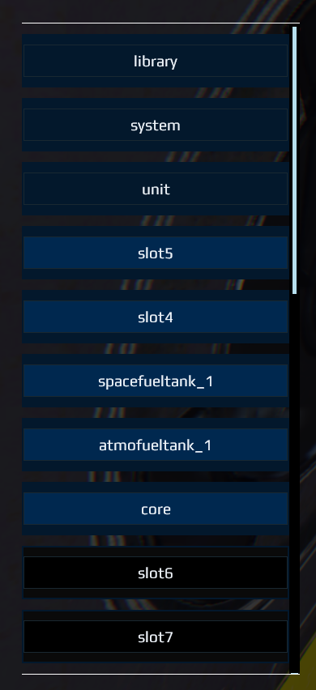

## DU-Orbital-Hud
Dual Universe HUD with orbital information, braking distances, and Rezoix's pitch/roll hud with some fixes

If you wish to save your current config, right click your seat and Copy Lua Configuration to Clipboard, and save it somewhere

# Usage
Before you begin, save your current seat config if you wish.  Due to a bug with pasting, first right click your seat -> Advanced -> Edit Lua Configuration.  Take a screenshot or write down the blue names on the left, as shown here, starting after unit: 

Then copy the contents of HoverSeat file above, and right click the seat, then Advanced -> Paste Lua Configuration from Clipboard

Once this is done, you need to put the names back to how they were.  As you can see in the above screenshot example, some slots may be changed to say 'slot4' 'slot5' etc, those will cause script errors if the names are not fixed.  **You must put them back exactly the same, in the same order**

Otherwise no gyro or any other components required, that should do it.

# Warnings
If you are in atmosphere, the Max Brake Distance listed on the Interplanetary widget will be inaccurate, since it will be using your atmospheric brakes to calculate.  Once you enter space, it should be accurate.

## Controls
Alt+1 and Alt+2 (Option1 and Option2) to scroll between target planets for the Interplanetary Helper.  This widget will not display if no planet is selected (ie you must press one of these hotkeys after entering the seat in order to show the widget)

## Customization
You may edit the R,G,B LUA parameters to set the main color of the HUD

### Features
**Rezoix HUD** (i.e. pitch/roll/yaw indicators), with LUA-parameter RGB values so you can set the base color, and with fixes (yaw is displayed in space properly instead of pitch, throttle indicator is fixed, gyro no longer required) - https://github.com/Rezoix/DU-hud

**Orbital Information widget** - Shows apoapsis, periapsis, apogee, perigee, eccentricity for the nearest planet, using these libraries: https://gitlab.com/JayleBreak/dualuniverse/-/tree/master/DUflightfiles/autoconf/custom

**Interplanetary Helper** - Use Alt+1 and Alt+2 to cycle through target planets.  Shows distance, travel time (including acceleration, travel, and braking - absolute total), brake time (current and max).  Note that currently, Brake Time is inaccurate if you're inside atmosphere.  Once you're in space, it will properly read the space brakes and give the correct values

**Brake Indicator/Toggle** - Brake is now a toggle, and is on by default when entering the seat.  There is an onscreen text indicator to show you when the brake is on
